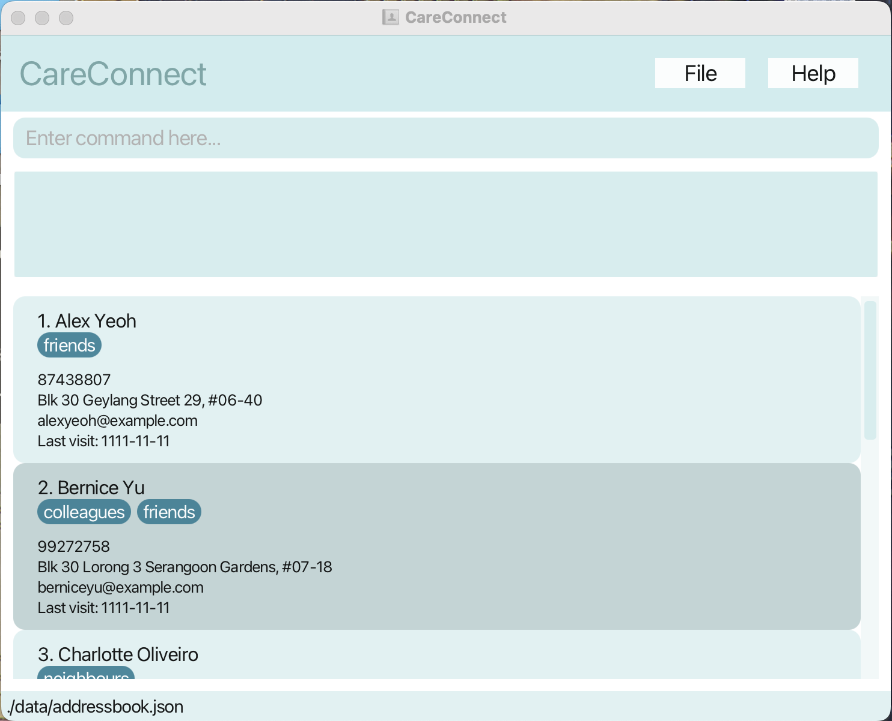

* This is **a software for social workers to track patient information**. 
  Example usages:
  * as a platform to track the address of different patients for home visits
  * as a way to track patients' medical conditions
* It is named `CareConnect` as it helps social workers focus on providing care instead of maintaining patient information.
* For the detailed documentation of this project, see the **[Address Book Product Website](https://se-education.org/addressbook-level3)**.
* This project is based on the AddressBook-Level3 project created by the [SE-EDU initiative](https://se-education.org).
* * This project is a **part of the se-education.org** initiative. If you would like to contribute code to this project, see [se-education.org](https://se-education.org/#contributing-to-se-edu) for more info.
