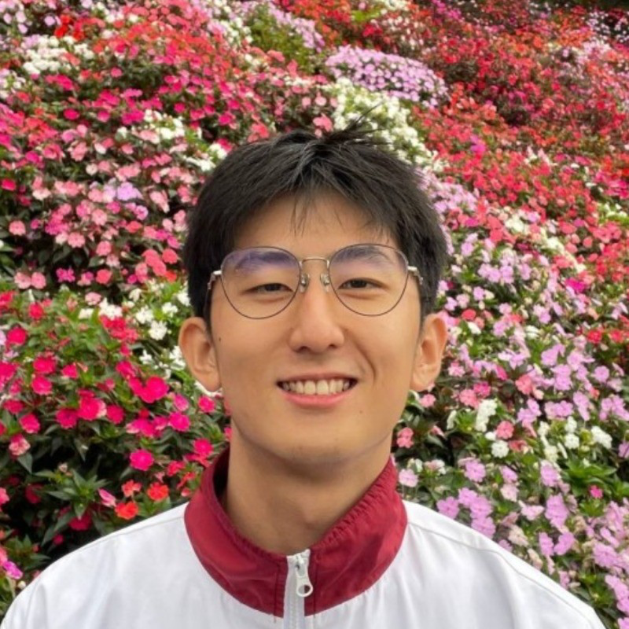
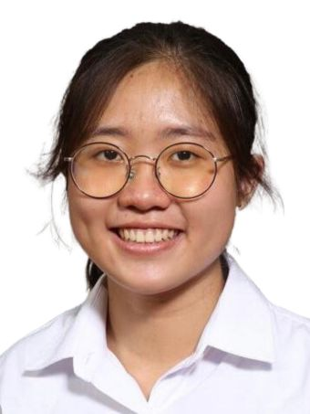
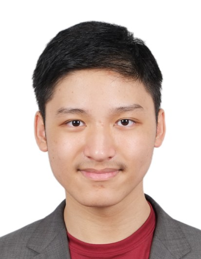

We are a team based in the [School of Computing, National University of Singapore](https://www.comp.nus.edu.sg).

You can reach us at the email `seer[at]comp.nus.edu.sg`

## Project team

### Liu Jihan

[[homepage](http://www.comp.nus.edu.sg/~damithch)]
[[github](https://github.com/Liu-Jihan)]
[[portfolio](team/johndoe.md)]

* Role: Project Advisor

### Ng Wan Ting Eunice

[[github](http://github.com/Eun777)]
[[portfolio](https://www.linkedin.com/in/eunice-ng-wt)]

* Role: Documentation
* Responsibilities: UX, Documentation

### Luoqi Xu

[[github](https://github.com/Luoq1-Xu)] [[portfolio](https://crowded-kittens.vercel.app/about)]

* Role: Developer
* Responsibilities: Develop functionalities for the app, including commands and features.

### Tan Sze Ling

[[github](http://github.com/szelingtan)]
[[portfolio](https://www.linkedin.com/in/sze-ling-tan-921b74263/)]

* Role: Developer
* Responsibilities: Dev Ops + Threading

### Sanchez Bryce Ainsley Ang

[[github](https://github.com/Bryce-3D)]
[[portfolio](https://www.linkedin.com/in/bryce3d/)]

* Role: Software Engineer
* Responsibilities: Backend or something
