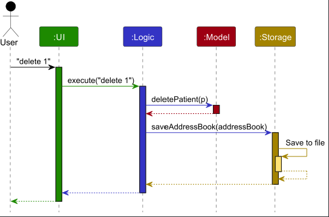
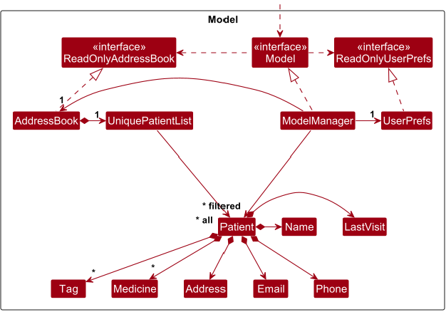
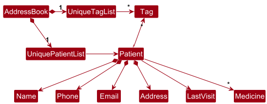
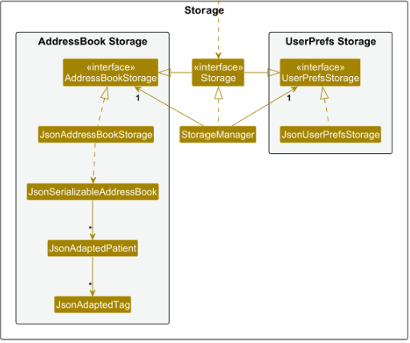

## Table of Contents
## Table of Contents
1. [Developer Guide](#developer-guide)
2. [Acknowledgements](#acknowledgements)
3. [Setting up, getting started](#setting-up-getting-started)
4. [Design](#design)
    - [Architecture](#architecture)
    - [UI component](#ui-component)
    - [Logic component](#logic-component)
    - [Special Case: ClearCommandParser](#special-case-clearcommandparser-)
    - [Model component](#model-component)
    - [Storage component](#storage-component)
    - [Common classes](#common-classes)
5. [Implementation](#implementation)
    - [Sort feature](#sort-feature)
        - [Current Implementation](#current-implementation)
        - [Class Structure](#class-structure)
        - [SortCommand](#sortcommand)
        - [SortCommandParser](#sortcommandparser)
        - [Logic Interface](#logic-interface)
        - [LogicManager](#logicmanager)
        - [Model Interface](#model-interface)
        - [ModelManager](#modelmanager)
        - [Execution Flow](#execution-flow)
        - [Design considerations](#design-considerations)
        - [Interactions with other features](#interactions-with-other-features)
6. [Proposed Enhancements](#proposed-enhancements)
    - [Undo/redo feature](#proposed-undoredo-feature)
        - [Proposed Implementation](#proposed-implementation)
        - [Design considerations](#design-considerations-1)
    - [Data archiving](#proposed-data-archiving)
7. [Documentation, logging, testing, configuration, dev-ops](#documentation-logging-testing-configuration-dev-ops)
8. [Appendix: Requirements](#appendix-requirements)
    - [Product scope](#product-scope)
    - [User stories](#user-stories)
    - [Use cases](#use-cases)
        - [UC01 List all students under User](#use-case-uc01-list-all-students-under-user)
        - [UC02 Delete a student](#use-case-uc02-delete-a-student)
        - [UC03 Add a student](#use-case-uc03-add-a-student)
    - [Non-Functional Requirements](#non-functional-requirements)
    - [Prof-iler](#prof-iler)
    - [Glossary](#glossary)
    - [Project](#project-the-title-of-the-research-project-a-student-is-working-on)
9. [Appendix: Instructions for manual testing](#appendix-instructions-for-manual-testing)
    - [Launch and shutdown](#launch-and-shutdown)
    - [Deleting a student](#deleting-a-student)
    - [Saving data](#saving-data)
10. [Appendix: Effort](#appendix-effort)

## **Acknowledgements**

* We would like to acknowledge the following repository as the foundational starting point for our project:
[nus-cs2103-AY2425S2/tp](https://github.com/nus-cs2103-AY2425S2/tp)

--------------------------------------------------------------------------------------------------------------------

## **Setting up, getting started**

Refer to the guide [_Setting up and getting started_](SettingUp.md).

--------------------------------------------------------------------------------------------------------------------

## **Design**

bulb: **Tip:** The `.puml` files used to create diagrams in this document `docs/diagrams` folder. Refer to the [_PlantUML Tutorial_ at se-edu/guides](https://se-education.org/guides/tutorials/plantUml.html) to learn how to create and edit diagrams.

### Architecture

  

The ***Architecture Diagram*** given above explains the high-level design of the App.

Given below is a quick overview of main components and how they interact with each other.

**Main components of the architecture**

**`Main`** (consisting of classes [`Main`](https://github.com/se-edu/addressbook-level3/tree/master/src/main/java/seedu/address/Main.java) and [`MainApp`](https://github.com/se-edu/addressbook-level3/tree/master/src/main/java/seedu/address/MainApp.java)) is in charge of the app launch and shut down.
* At app launch, it initializes the other components in the correct sequence, and connects them up with each other.
* At shut down, it shuts down the other components and invokes cleanup methods where necessary.

The bulk of the app's work is done by the following four components:

* [**`UI`**](#ui-component): The UI of the App.
* [**`Logic`**](#logic-component): The command executor.
* [**`Model`**](#model-component): Holds the data of the App in memory.
* [**`Storage`**](#storage-component): Reads data from, and writes data to, the hard disk.

[**`Commons`**](#common-classes) represents a collection of classes used by multiple other components.

**How the architecture components interact with each other**

The *Sequence Diagram* below shows how the components interact with each other for the scenario where the user issues the command `delete 1`.

Each of the four main components (also shown in the diagram above),

* defines its *API* in an `interface` with the same name as the Component.
* implements its functionality using a concrete `{Component Name}Manager` class (which follows the corresponding API `interface` mentioned in the previous point.)

For example, the `Logic` component defines its API in the `Logic.java` interface and implements its functionality using the `LogicManager.java` class which follows the `Logic` interface. Other components interact with a given component through its interface rather than the concrete class (reason: to prevent outside component's being coupled to the implementation of a component), as illustrated in the (partial) class diagram below.

  

The sections below give more details of each component.

### UI component

The **API** of this component is specified in [`Ui.java`](https://github.com/se-edu/addressbook-level3/tree/master/src/main/java/seedu/address/ui/Ui.java)

  

The UI consists of a `MainWindow` that is made up of parts e.g.`CommandBox`, `ResultDisplay`, `PatientListPanel`, `StatusBarFooter` etc. All these, including the `MainWindow`, inherit from the abstract `UiPart` class which captures the commonalities between classes that represent parts of the visible GUI.

The `UI` component uses the JavaFx UI framework. The layout of these UI parts are defined in matching `.fxml` files that are in the `src/main/resources/view` folder. For example, the layout of the [`MainWindow`](https://github.com/se-edu/addressbook-level3/tree/master/src/main/java/seedu/address/ui/MainWindow.java) is specified in [`MainWindow.fxml`](https://github.com/se-edu/addressbook-level3/tree/master/src/main/resources/view/MainWindow.fxml)

The `UI` component,

* executes user commands using the `Logic` component.
* listens for changes to `Model` data so that the UI can be updated with the modified data.
* keeps a reference to the `Logic` component, because the `UI` relies on the `Logic` to execute commands.
* depends on some classes in the `Model` component, as it displays `patient` object residing in the `Model`.

### Logic component

**API** : [`Logic.java`](https://github.com/se-edu/addressbook-level3/tree/master/src/main/java/seedu/address/logic/Logic.java)

Here's a (partial) class diagram of the `Logic` component:

The sequence diagram below illustrates the interactions within the `Logic` component, taking `execute("delete 1")` API call as an example.

information_source: **Note:** The lifeline for `DeleteCommandParser` should end at the destroy marker (X) but due to a limitation of PlantUML, the lifeline continues till the end of diagram.

How the `Logic` component works:

1. When `Logic` is called upon to execute a command, it is passed to an `AddressBookParser` object which in turn creates a parser that matches the command (e.g., `DeleteCommandParser`) and uses it to parse the command.
2. This results in a `Command` object (more precisely, an object of one of its subclasses e.g., `DeleteCommand`) which is executed by the `LogicManager`.
3. The command can communicate with the `Model` when it is executed (e.g. to delete a patient). 
   Note that although this is shown as a single step in the diagram above (for simplicity), in the code it can take several interactions (between the command object and the `Model`) to achieve.
4. The result of the command execution is encapsulated as a `CommandResult` object which is returned back from `Logic`.

Here are the other classes in `Logic` (omitted from the class diagram above) that are used for parsing a user command:

How the parsing works:
* When called upon to parse a user command, the `AddressBookParser` class creates an `XYZCommandParser` (`XYZ` is a placeholder for the specific command name e.g., `AddCommandParser`) which uses the other classes shown above to parse the user command and create a `XYZCommand` object (e.g., `AddCommand`) which the `AddressBookParser` returns back as a `Command` object.
* All `XYZCommandParser` classes (e.g., `AddCommandParser`, `DeleteCommandParser`, ...) inherit from the `Parser` interface so that they can be treated similarly where possible e.g, during testing.

### Model component
**API** : [`Model.java`](https://github.com/se-edu/addressbook-level3/tree/master/src/main/java/seedu/address/model/Model.java)

The `Model` component,

* stores the patients' data i.e., all `patient` objects (which are contained in a `UniquePatientList` object).
* stores the currently 'selected' `patient` objects (e.g., results of a search query) as a separate _filtered_ list which is exposed to outsiders as an unmodifiable `ObservableList<patient>` that can be 'observed' e.g. the UI can be bound to this list so that the UI automatically updates when the data in the list change.
* stores a `UserPref` object that represents the user’s preferences. This is exposed to the outside as a `ReadOnlyUserPref` objects.
* does not depend on any of the other three components (as the `Model` represents data entities of the domain, they should make sense on their own without depending on other components)

:information_source: **Note:** An alternative (arguably, a more OOP) model is given below. It has a `Tag` list in the `AddressBook`, which `patient` references. This allows `AddressBook` to only require one `Tag` object per unique tag, instead of each `patient` needing their own `Tag` objects. 

### Storage component

**API** : [`Storage.java`](https://github.com/se-edu/addressbook-level3/tree/master/src/main/java/seedu/address/storage/Storage.java)

The `Storage` component,
* can save both the patients' data and user preference data in JSON format, and read them back into corresponding objects.
* inherits from both `AddressBookStorage` and `UserPrefStorage`, which means it can be treated as either one (if only the functionality of only one is needed).
* depends on some classes in the `Model` component (because the `Storage` component's job is to save/retrieve objects that belong to the `Model`)

### Common classes

Classes used by multiple components are in the `seedu.address.commons` package.

--------------------------------------------------------------------------------------------------------------------

## **Implementations of Key Features**

This section describes detailed implementation notes for  the `add` feature
(A Patient Management Feature) to help you gain a 
better understanding of CareConnect.

### Add feature
The `add` feature enables users to add new patients to the patient list.

#### Execution flow

1. User inputs the command to create a new patient
2. A `LogicManager` object is called to execute the command
3. The `LogicManager` object calls the `parseCommand` method of an `addressBookParser` object to parse the user's input
4. The `addressBookParser` matches the command, identifying the `add` command's `Command Word` (which is `add`),
   and thus creates an `addCommandParser`.
5. The `parse` method of that `addCommandParser` object is called, which parses
   the user's input and returns an `addCommand` object to the `addressBookParser` object.
6. This `addCommand` is then returned to the `LogicManager` object, which calls the `execute` method 
   in the `addCommand` object, passing in a `model` object.
7. In the `execute` method, the `addPatient` method of the `model` is called, which adds a patient to the `model`.
8. The command finishes executing, and a success message is displayed.

### [Proposed] Undo/redo feature

#### Proposed Implementation

The proposed undo/redo mechanism is facilitated by `VersionedAddressBook`. It extends `AddressBook` with an undo/redo history, stored internally as an `addressBookStateList` and `currentStatePointer`. Additionally, it implements the following operations:

* `VersionedAddressBook#commit()` — Saves the current AddressBook state in its history.
* `VersionedAddressBook#undo()` — Restores the previous AddressBook state from its history.
* `VersionedAddressBook#redo()` — Restores a previously undone AddressBook state from its history.

These operations are exposed in the `Model` interface as `Model#commitAddressBook()`, `Model#undoAddressBook()` and `Model#redoAddressBook()` respectively.

Given below is an example usage scenario and how the undo/redo mechanism behaves at each step.

Step 1. The user launches the application for the first time. The `VersionedAddressBook` will be initialized with the initial AddressBook state, and the `currentStatePointer` pointing to that single AddressBook state.

Step 2. The user executes `delete 5` command to delete the 5th patient in the patient book. The 
`delete` command calls `Model#commitAddressBook()`, causing the modified state of the AddressBook.
after the `delete 5` command executes to be saved in the `addressBookStateList`, and the `currentStatePointer` is shifted to the newly inserted AddressBook state.

Step 3. The user executes `add n/David …​` to add a new patient. The `add` command also calls `Model#commitAddressBook()`, causing another modified AddressBook state to be saved into the `addressBookStateList`.

:information_source: **Note:** If a command fails its execution, it will not call `Model#commitAddressBook()`, so the AddressBook state will not be saved into the `addressBookStateList`.

Step 4. The user now decides that adding the patient was a mistake, and decides to undo that action by executing the `undo` command. The `undo` command will call `Model#undoAddressBook()`, which will shift the `currentStatePointer` once to the left, pointing it to the previous AddressBook state, and restores the AddressBook to that state.

:information_source: **Note:** If the `currentStatePointer` is at index 0, pointing to the initial AddressBook state, then there are no previous AddressBook states to restore. The `undo` command uses `Model#canUndoAddressBook()` to check if this is the case. If so, it will return an error to the user rather
than attempting to perform the undo.

The following sequence diagram shows how an undo operation goes through the `Logic` component:

:information_source: **Note:** The lifeline for `UndoCommand` should end at the destroy marker (X) but due to a limitation of PlantUML, the lifeline reaches the end of diagram.

Similarly, how an undo operation goes through the `Model` component is shown below:

The `redo` command does the opposite — it calls `Model#redoAddressBook()`, which shifts the `currentStatePointer` once to the right, pointing to the previously undone state, and restores the AddressBook to that state.

:information_source: **Note:** If the `currentStatePointer` is at index `addressBookStateList.size() - 1`, pointing to the latest AddressBook state, then there are no undone AddressBook states to restore. The `redo` command uses `Model#canRedoAddressBook()` to check if this is the case. If so, it will return an error to the user rather than attempting to perform the redo.

Step 5. The user then decides to execute the command `list`. Commands that do not modify the 
patient book, such as `list`, will usually not call `Model#commitAddressBook()`, `Model#undoAddressBook()` or `Model#redoAddressBook()`. Thus, the `addressBookStateList` remains unchanged.

Step 6. The user executes `clear`, which calls `Model#commitAddressBook()`. Since the `currentStatePointer` is not pointing at the end of the `addressBookStateList`, all AddressBook states after the `currentStatePointer` will be purged. Reason: It no longer makes sense to redo the `add n/David …​` command. This is the behavior that most modern desktop applications follow.

The following activity diagram summarizes what happens when a user executes a new command:

#### Design considerations:

**Aspect: How undo & redo executes:**

* **Alternative 1 (current choice):** Saves the entire patient list.
  * Pros: Easy to implement.
  * Cons: May have performance issues in terms of memory usage.

* **Alternative 2:** Individual command knows how to undo/redo by
  itself.
  * Pros: Will use less memory (e.g. for `delete`, just save the patient being deleted).
  * Cons: We must ensure that the implementations of each command are correct.

--------------------------------------------------------------------------------------------------------------------

## **Documentation, logging, testing, configuration, dev-ops**

* [Documentation guide](Documentation.md)
* [Testing guide](Testing.md)
* [Logging guide](Logging.md)
* [Configuration guide](Configuration.md)
* [DevOps guide](DevOps.md)

--------------------------------------------------------------------------------------------------------------------

## **Appendix: Requirements**

### Product scope

**Target user profile**: Social Workers

* has a need to manage a significant number of patient contacts
* has a need to track patient visits
* decent but not exceptional typing speed
* prefers desktop apps over other types
* may not be particularly comfortable using CLI apps

**Value proposition**: manage patient details and visits more efficiently than paper records

### User stories

Priorities: High (must have) - `* * *`, Medium (nice to have) - `* *`, Low (unlikely to have) - `*`

| Priority | As a …​       | I want to …​                 | So that I can…​                                         |
| -------- |---------------|------------------------------|---------------------------------------------------------|
| `* * *`  | social worker | add contacts of new patients | keep track of the new patients' details                 |
| `* * *`  | social worker | delete patient contacts      | remove discharged / deceased patients from patient book |
| `* * *`  | social worker | tag a patient                | identify the patient's condition                        |
| `* * *`  | social worker | add patient medication       | keep track of medication taken by the patient           |
| `* *`    | social worker | add last visit               | keep track of my last visit to the patient              |
| `*`      | social worker | edit patient details         | update changes in patient information when necessary    |
| `*`      | social worker | add remarks after each visit | document important information                          |

### Use cases

(For all use cases below, the **System** is the `CareConnect` and the **Actor** is the `user`, 
unless specified otherwise)

**Use case: Add a patient**

**MSS**

1.  User requests to add a patient
2.  CareConnect prompts for patient details
3.  User enters patient's name, phone number, email, and address
4.  CareConnect adds the patient and confirms the addition

    Use case ends.

**Extensions**

* 3a. User enters an invalid phone number.
  * 3a1. CareConnect shows an error message.
  * 3a2. User enters a valid phone number.

      Use case resumes at step 3.

* 3b. User enters an invalid email.
  * 3b1. CareConnect shows an error message.
  * 3b2. User enters a valid email.

      Use case resumes at step 3.

* 3c. User omits one or more required fields.
  * 3c1. CareConnect shows an error message.
  * 3c2. User enters all required information.

      Use case resumes at step 3.

* 3d. User enters details for a patient with same name and phone number as an existing patient.
  * 3d1. CareConnect alerts the user about the duplicate.
  * 3d2. User enters different information or cancels the operation.

      Use case resumes at step 3.

**Use case: Delete a patient**

**MSS**

1.  User requests to list patients
2.  CareConnect shows a list of patients
3.  User requests to delete a specific patient in the list
4.  CareConnect deletes the patient and confirms the deletion

Use case ends.

**Extensions**

* 2a. The list is empty.

    Use case ends.

* 3a. The given index is invalid.
  * 3a1. CareConnect shows an error message.

    Use case resumes at step 2.

* 3b. User does not specify an index.
  * 3b1. CareConnect shows an error message.

    Use case resumes at step 2.

**Use case: Tag a patient**

**MSS**

1.  User requests to list patients
2.  CareConnect shows a list of patients
3.  User requests to tag a specific patient with a category
4.  CareConnect adds the tag to the patient and confirms the addition

Use case ends.

**Extensions**

* 2a. The list is empty.

    Use case ends.

* 3a. The given index is invalid.
    * 3a1. CareConnect shows an error message.

        Use case resumes at step 2.

* 3b. User does not specify a tag name.
    * 3b1. CareConnect shows an error message.

      Use case resumes at step 3.
      Use Case: Untag a patient
      Main Success Scenario (MSS)

**Use case: Untag a patient**

**MSS**

1. User requests to list patients
2. CareConnect shows a list of patients
3. User requests to remove tags from a specific patient using one of the following: 
untag to remove specific tags, or remove all tags
4. CareConnect removes the tags accordingly and confirms the removal

Use case ends.

**Extensions**
* 2a. The list is empty.

  Use case ends.

* 3a. The given index is invalid.
    * 3a1. CareConnect shows an error message.

      Use case resumes at step 2.

* 3b. No tags are specified with t/
    * 3b1. CareConnect shows an error message.

      Use case resumes at step 3.
      Use Case: Untag a patient
      Main Success Scenario (MSS)
  
* 3c. The specified tags are not present in the patient’s tag list
    * 3c1. CareConnect shows an error message
    * 
      Use case resumes at step 3.
  
* 3d. The patient has no tags, but the user uses untag INDEX t/all
    * CareConnect shows an error message indicating there are no tags to remove
    * Use case resumes at step 3.

**Use case: Add medication to a patient**

**MSS**

1.  User requests to list patients
2.  CareConnect shows a list of patients
3.  User requests to add medication for a specific patient
4.  CareConnect adds the medication to the patient's record and confirms the addition

Use case ends.

**Extensions**

* 2a. The list is empty.

    Use case ends.

* 3a. The given index is invalid.
  * 3a1. CareConnect shows an error message.

      Use case resumes at step 2.

* 3b. User does not specify medication details.
  * 3b1. CareConnect shows an error message.

    Use case resumes at step 3.

**Use case: Delete a medication for a patient**

**MSS**

1.  User requests to list patients
2.  CareConnect shows a list of patients
3.  User requests to delete medication for a specific patient
4.  CareConnect removes the medication from the patient's record and confirms the deletion

Use case ends.

**Extensions**

* 2a. The list is empty.

    Use case ends.

* 3a. The given index is invalid.
  * 3a1. CareConnect shows an error message.

      Use case resumes at step 2.

* 3b. The patient has no medication records.
  * CareConnect shows an error message.

    Use case ends.

**Use case: Add medication to a patient**

**MSS**

1.  User requests to list patients
2.  CareConnect shows a list of patients
3.  User requests to add medication for a specific patient
4.  CareConnect adds the medication to the patient's record and confirms the addition

Use case ends.

**Extensions**

* 2a. The list is empty.

    Use case ends.

* 3a. The given index is invalid.
    * 3a1. CareConnect shows an error message.

      Use case resumes at step 2.

* 3b. User does not specify medication details.
    * 3b1. CareConnect shows an error message.

      Use case resumes at step 3.

**Use case: Delete last visit**

**MSS**

1.  User requests to list patients
2.  CareConnect shows a list of patients
3.  User requests to delete the last visit record of a specific patient
4.  CareConnect removes the visit information and confirms the deletion

Use case ends.

**Extensions**

* 2a. The list is empty.

    Use case ends.

* 3a. The given index is invalid.
    * 3a1. CareConnect shows an error message.

      Use case resumes at step 2.

* 3b. The patient has no visit records.
    * CareConnect shows an error message.

      Use case ends.

### Non-Functional Requirements

1. **Cross-Platform Compatibility**
    - Should work on any mainstream OS (Windows, macOS, Linux) as long as it has Java 17 or above installed.

2. **Performance**
    - Should be able to hold up to **1000 patients** without noticeable sluggishness in performance for typical usage.
    - Should start up within **3 seconds** on a typical consumer laptop with at least **8GB RAM and an SSD**.

3. **Scalability**
    - Should maintain performance when handling up to **10000 patients**, though minor degradation is acceptable.
    - Should allow for future expansion without requiring a complete system overhaul.

4. **Usability**
    - A user with **above-average typing speed** for regular English text (i.e., not code, not system admin commands) should be able to accomplish most tasks **faster using commands than using the mouse**.
    - **Keyboard shortcuts** should be provided for power users to navigate the application efficiently.
    - The UI should be **intuitive enough** for new users to accomplish basic tasks within **5 minutes of exploration**.

5. **Accessibility**
    - Should support **screen readers and keyboard navigation** to ensure usability for users with disabilities.
    - Should have **sufficient contrast and text scaling options** to accommodate visually impaired users.

6. **Portability**
    - Should not require **installation beyond Java 17** (i.e., should work as a standalone JAR or similar distribution).
    - Should not require **administrative privileges** to run on Windows, macOS, or Linux.

7. **Security**
    - Should not require **internet access** for core functionality to ensure **data privacy**.
    - Should prevent **unauthorized modification** of critical data without explicit user confirmation.

8. **Reliability**
    - Should not crash or lose user data due to **unexpected shutdowns** (e.g., power failure).
    - Should have **autosave functionality** to prevent accidental data loss.

9. **Maintainability**
    - Codebase should follow **OOP principles** to ensure ease of maintenance.
    - Should be **modular**, allowing for feature enhancements without major rewrites.

### Glossary

* **Social Workers**: The target demographic, specifically those who
  do patient visits for the elderly
* **Contacts**: Information such as phone number, address, and email that
  can be used to reach a patient in the application.
* **Tag**: A label assigned to a patient in the application.
* **Patient Details**: Details relating to a patient such as their illness,
  required medication, etc.
* **Remarks**: Any special detail related to visits to the patient.

--------------------------------------------------------------------------------------------------------------------

## **Appendix: Instructions for manual testing**

Given below are instructions to test the app manually.

:information_source: **Note:** These instructions only provide a starting point for testers to work on;
testers are expected to do more *exploratory* testing.

### Launch and shutdown

1. Initial launch
   1. Download the jar file and copy into an empty folder.
   1. Double-click the jar file  
   Expected: Shows the GUI with a set of sample contacts. The window size may not be optimal.

1. Saving window preferences
   1. Resize the window to an optimum size. Move the window to a different location. Close the window.
   1. Re-launch the app by double-clicking the jar file. 
   Expected: The most recent window size and location is retained.

### Deleting a patient
1. Deleting a patient while all patients are being shown
   1. Prerequisites: List all patients using the `list` command. Multiple patients in the list.
   1. Test case: `delete 1` 
      Expected: The first patient is deleted from the list. Details of the deleted patient shown in the status message. Timestamp in the status bar is updated.
   1. Test case: `delete 0` 
      Expected: No patient is deleted. Error details shown in the status message. Status bar remains the same.
   1. Other incorrect delete commands to try: `delete`, `delete x`, `...` (where x is larger than the list size)  
      Expected: Similar to previous.

### Saving data

1. Dealing with missing data files
    1. Find the JSON file with the data in the `data` folder.
    1. Delete it while CareConnect is closed.
    1. Launch the app and see how it runs.  
       Expected: Launch the app with the default sample data list.

1. Dealing with corrupted data files
    1. Prerequisites: The data folder exists with the JSON file storing the data.
    1. Find the JSON file with the data in the `data` folder.
    1. Modify it manually such that it is no longer a valid JSON file (e.g., by mismatching the curly braces).
    1. Launch the app and see how it runs.
   
    Expected: Launch the app as normal with a blank list.

### Editing a patient

1. Editing a patient's name
   1. Prerequisites: Have a list of at least 3 patients, none of which are named "Akemi Homura" or "Kaname Madoka".
   1. Test case: `edit 1 n/Akemi Homura`   
   Expected: The name of the 1st patient is successfully changed to "Akemi Homura".
   1. Test case: `edit 3 n/Kaname Madoka`  
   Expected: The name of the 3rd patient is successfully changed to "Kaname Madoka".

1. Editing a patient's address
   1. Prerequisites: Have a list of at least 2 patients.
   1. Test case: `edit 2 a/Kamihama City`  
   Expected: The address of the 2nd patient is successfully changed to "Kamihama City".

### Tagging and untagging a patient

1. Tagging patients
   1. Prerequisites: Have a list of at least 3 patients, all of which have no tags.
   1. Test case: `tag 1 t/Dysphoria t/ASD`  
   Expected: Successfully add *both* Dysphoria and ASD as tags to the 1st patient.
   1. Test case: `tag 1 t/ASD`  
   Expected: Get an error saying that the 1st patient already has the ASD tag (due to the previous test).
   1. Test case: `tag 3 t/Anxiety`  
   Expected: Successfully add Anxiety as a tag to the 3rd patient.

1. Untagging patients
   1. Prerequisites: Have a list of at least 2 patients, all of which have the tags "Dysphoria", "ASD", and "Anxiety".
   1. Test case: `untag 1 t/ASD`  
   Expected: Successfully remove only the ASD tag from the 1st patient.
   1. Test case: `untag 1 t/ASD`  
   Expected: Get an error saying that the 1st patient does not have the tag ASD (due to the previous test).
   1. Test case: `untag 2 t/Dysphoria t/Anxiety`  
   Expected: Successfully remove both the Dysphoria and Anxiety tags from the 2nd patient.

1. Using the untag all feature
   1. Prerequisites: Have a list of at least 2 patients, all of which have at least 2 tags.
   1. Test case: `untag 2 t/all`  
   Expected: Successfully remove all tags from the 2nd patient.

### Prescribing and unprescribing medicine

1. Prescribing medicine
   1. Prerequisites: Have a list of at least 3 patients, all of which have no medicine.
   1. Test case: `prescribe 1 m/Estrogen m/Anti-androgens`  
   Expected: Successfully prescribe *both* Estrogen and Anti-androgens to the 1st patient.
   1. Test case: `prescribe 1 m/Estrogen`   
   Expected: Get an error saying that the 1st patient already has Estrogen prescribed (due to the previous test).
   1. Test case: `prescribe 3 m/Testosterone`  
   Expected: Successfully prescribe Testosterone to the 3rd patient.

1. Unprescribing medicine
   1. Prerequisites: Have at least 2 patients, all of which have Estrogen, Anti-androgens, and Ibuprofen prescribed.
   1. Test case: `unprescribe 2 m/Ibuprofen`  
   Expected: Successfully unprescribe only Ibuprofen from the 2nd patient.
   1. Test case: `unprescribe 2 m/Estrogen m/Ibuprofen`  
   Expected: Get an error saying that the 2nd patient does not have Ibuprofen prescribed (due to the previous test).

1. Using the unprescribe all feature
   1. Prerequisites: Have a list of at least 2 patients, all of which have at least 2 prescribed medicines.
   1. Test case: `unprescribe 2 m/all`  
<<<<<<< HEAD
   Expected: Successfully unprescribe all medicines from the 2nd patient.
=======
   Expected: Successfully unprescribe all medicines from the 2nd patient.

--------------------------------------------------------------------------------------------------------------------

## **Appendix:Planned Enhancements**

### The team size is **5**.

### 1.) \[Enhancement\] Input Validation for `find`

Currently, there is no input validation for the `find` command. This means that an input such as
> `find &^%$*&!%$(*&`

would be accepted despite it not being possibly part of any name.

Another possible confusion is if the `/strict` prefix were mistyped as `strict/`, causing an input such as
> `find strict/ Homura`

to instead search for the names `strict/` and `Homura` not strictly rather than searching `Homura` strictly

A future update could parse the input and give an error message to the user when an invalid search name is entered.

### 2.) \[Enhancement\] Duplicate Detection for `add`

Currently, CareConnect compares strings case insensitively. However, it still takes into account spaces.

This means that names such as "Akemi Homura" and "Akemi &nbsp;&nbsp;&nbsp; Homura" count as different people
even though they likely should refer to the same person.

We could add a check that splits the name by whitespace and compares the parts case-insensitively, then give a warning to the user if a potential duplicate is found.

### 3.) \[Enhancement\] Non-ambiguous `untag t/all` or `unprescribe m/all`

Currently, there is some slight ambiguity in these delete all functions. They could be interpreted as
removing the tag "all" or removing the medicine "all".

It is very unlikely that a user would create a tag named "all" or prescribe a medicine "all", since they don't
mean anything in the context of a patient under the care of a social worker.

However, removing this ambiguity would still be preferable. This could be done by making them
entirely separate commands like `untagAll` and `unprescribeAll`, or making the keyword to trigger
the deletion not a valid tag/medicine so there is no ambiguity such as `untag t/[ALL]` and
`unprescribe m/[ALL]` since `[` and `]` are not valid characters for tags and medicines.

### 4.) \[Enhancement\] Renaming internal uses of `addressBook` to `careConnect`

Currently, many internal functions and classes still reference `addressBook`, which is why most of the Developer Guide
still references `addressBook`. In the future, we hope to replace instances of `addressBook` with `CareConnect`, to
better reflect `CareConnect`'s status as separate from `addressBook`.

>>>>>>> 13947f112a062696634c0531772110df368626d2
