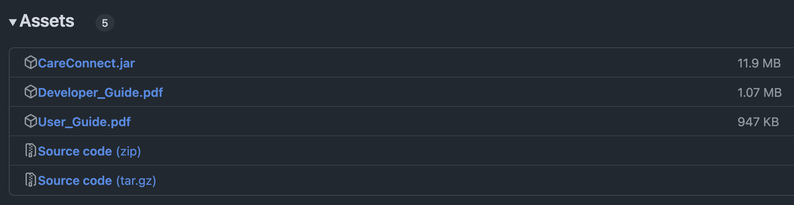

# CareConnect User Guide

CareConnect is a **desktop app for managing patients,
optimized for use via a Command Line Interface (CLI) while still having the benefits of a Graphical User Interface(GUI)**.
Created for social workers, CareConnect allows you to not only **track patient contacts** but also their **diagnosis,
prescriptions and last visit information** on a single app.

### Table of Contents
* [Quick start](#quick-start)
* [Command summary](#command-summary)
* [Input Requirements](#input-requirements)
* [Features](#features)
    * [Patient Management](#patient-management)
        * [Adding a patient: `add`](#adding-a-patient-add)
        * [Editing a patient: `edit`](#editing-a-patient--edit)
        * [Deleting a patient: `delete`](#deleting-a-patient--delete)
        * [Listing all patients: `list`](#listing-all-patients--list)
        * [Clearing all entries: `clear`](#clearing-all-entries--clear)
        * [Locating patients by name: `find`](#locating-patients-by-name-find)
    * [Patient Data Management](#patient-data-management)
        * [Tag a patient: `tag`](#tag-a-patient--tag)
        * [Untag a patient: `untag`](#untag-a-patient--untag)
        * [Adding medication to a patient: `prescribe`](#adding-medication-to-a-patient--prescribe)
        * [Removing medication from a patient: `unprescribe`](#removing-medication-from-a-patient--unprescribe)
        * [Adding last visit record to a patient: `lastVisit`](#adding-last-visit-record-to-a-patient--lastvisit)
        * [Deleting the last visit information: `delLastVisit`](#deleting-the-last-visit-information--dellastvisit)
    * [App Navigation](#app-navigation)
        * [Viewing help: `help`](#viewing-help--help)
        * [Exiting the program: `exit`](#exiting-the-program--exit)
    * [Data File Management](#data-file-management)
        * [Saving the data](#saving-the-data)
        * [Editing the data file](#editing-the-data-file)
* [FAQ](#faq)
* [Known issues](#known-issues)

--------------------------------------------------------------------------------------------------------------------

## Quick start

1. Ensure you have Java `17` or above installed in your Computer. 
   A guide on how to install the required software can be found [here](https://se-education.org/guides/tutorials/javaInstallation.html).

2. Download the latest `.jar` file from [here](https://github.com/AY2425S2-CS2103T-T17-2/tp/releases). 
   The `.jar` file can be found under the Assets section. 

3. Copy the file to the folder you want to use as the _home folder_ for your CareConnect.

4. Open a command terminal, enter the folder containing the jar file using the `cd` command, and use the `java -jar CareConnect.jar` command to run the application. 
   A GUI similar to the below should appear in a few seconds. Note how the app contains some sample data. 
   

5. Type the command in the command box and press Enter to execute it. e.g. typing **`help`** and pressing Enter will open the help window. 
   Some example commands you can try:

    * `list` : Lists all patient contacts.

    * `add n/John Doe p/98765432 e/johnd@example.com a/John street, block 123, #01-01 d/2025-01-12 m/Insulin` : Adds a contact named `John Doe` to the patient contact book.

    * `delete 3` : Deletes the third contact shown in the current list.

    * `clear` : Deletes all contacts.

    * `exit` : Exits the app.

6. Refer to the [Features](#features) and [Command Summary](#command-summary) below for details of each command.

--------------------------------------------------------------------------------------------------------------------

## Command summary

| Action                | Format                                                                                   | Example                                                                                                         |
|-----------------------|------------------------------------------------------------------------------------------|-----------------------------------------------------------------------------------------------------------------|
| **Add**               | `add n/NAME p/PHONE_NUMBER e/EMAIL a/ADDRESS [d/LAST_VISIT_DATE] [t/TAG] [m/MEDICINE]…​` | `add n/James Ho p/98280482 e/jamesho@example.com a/123, Clementi Rd, 1234665 d/2025-01-25 t/diabetes m/Insulin` |
| **Edit**              | `edit INDEX [n/NAME] [p/PHONE_NUMBER] [e/EMAIL] [a/ADDRESS]…​`                           | `edit 2 n/James Lee e/jameslee@example.com`                                                                     |
| **Delete**            | `delete INDEX`                                                                           | `delete 3`                                                                                                      |
| **List**              | `list`                                                                                   |
| **Clear**             | `clear`                                                                                  |                                                                                                                 |
| **Find**              | `find KEYWORD [MORE_KEYWORDS]`    `find /strict KEYWORD `                            | `find James Jake`       `find /strict James Jake`                                                           |
| **Tag**               | `tag INDEX t/TAG [t/MORE_TAGS]...`                                                       | `tag 2 t/highBloodPressure`                                                                                     |
| **Untag**             | `untag INDEX t/TAG [t/MORE_TAGS]...`    `untag INDEX t/all`                          | `untag 2 t/highBloodPressure`    `untag 1 t/all`                                                            |
| **Prescribe**         | `prescribe INDEX m/MEDICINE_NAME`                                                        | `prescribe 1 m/Insulin`   `prescribe 1 m/Insulin m/Panadol`                                                 |
| **Unprescribe**       | `unprescribe INDEX m/MEDICINE_NAME`    `unprescribe INDEX m/all`                     | `unprescribe 1 m/Insulin`    `unprescribe 1 m/Insulin m/Panadol`   `unprescribe 1 m/all`                 |
| **Last Visit**        | `lastVisit INDEX d/LAST_VISIT_DATE`                                                      | `lastVisit 1 d/2025-03-15`                                                                                      |
| **Delete Last Visit** | `delLastVisit INDEX`                                                                     | `delLastVisit 2`                                                                                                |
| **Help**              | `help`                                                                                   |                                                                                                                 |
| **Exit**              | `exit`                                                                                   |

--------------------------------------------------------------------------------------------------------------------

### Input Requirements

| Input        | Requirements                                                                                                                                                                                                                                                                        | Example                             |
|--------------|-------------------------------------------------------------------------------------------------------------------------------------------------------------------------------------------------------------------------------------------------------------------------------------|-------------------------------------|
| **NAME**     | Alphanumeric, can contain spaces, cannot be blank. Duplicate names are not allowed (case-insensitive). e.g. "John Doe" and "JOHN DOE" are considered the same name. Other non-specified formats such as special characters including @ are currently not supported.                 | Tan Ah Kow                          |
| **PHONE**    | Contains only numbers, minimum 3 and maximum 16 digits. Note that only one phone number input is allowed.                                                                                                                                                                           | 87874848                            |
| **EMAIL**    | Must follow `<local-part>@<domain>` format. The `<local-part>` should only contain alphanumeric characters, except for `+`, `_`, `.` and `-` and cannot start or end with any special characters. The `<domain>` should only contain alphanumeric characters and the `.` character. | tanahkow@yahoo.com                  |
| **ADDRESS**  | No restrictions, cannot be blank.                                                                                                                                                                                                                                                   | Blk 519 Serangoon Avenue 1, #12-345 |
| **MEDICINE** | Alphanumeric, '-' and '_' allowed. For example: `low-blood-pressure` is a valid tag but `low blood pressure` is invalid. Medicines are case-insensitive.                                                                                                                            | Paracetamol, Insulin                |
| **TAG**      | Alphanumeric, '-' and '_' allowed. For example: `acetaminophen_codeine` is a valid medicine name but `acetaminophen codeine` is invalid. Tags are case-sensitive.                                                                                                                   | Diabetes, Osteoporosis              |
| **INDEX**    | Index of patient in the displayed patient list to be edited. Must be a **positive integer** 1, 2, 3, …​                                                                                                                                                                             | 1                                   |

--------------------------------------------------------------------------------------------------------------------
## Features

**:information_source: Notes about the command format:** 

* Words in `UPPER_CASE` are the parameters to be supplied by the user. 
  e.g. in `add n/NAME`, `NAME` is a parameter which can be used as `add n/John Doe`.

* Items in square brackets are optional. 
  e.g. `n/NAME [t/TAG]` can be used as `n/John Doe t/friend` or as `n/John Doe`.

* Items with `…​` after them can be used multiple times including zero times. 
  e.g. `[t/TAG]…​` can be used as ` ` (i.e. zero times), `t/friend`, `t/friend t/family` etc.

* Parameters can be in any order. 
  e.g. if the command specifies `n/NAME p/PHONE_NUMBER`, `p/PHONE_NUMBER n/NAME` is also acceptable.

* Extraneous parameters for `exit` command and `clear` command will be ignored. 
  e.g. if the command specifies `exit 123`, it will be interpreted as `exit`.

* If you are using a PDF version of this document, be careful when copying and pasting commands that span multiple lines as space characters surrounding line-breaks may be omitted when copied over to the application.

## Patient Management
A core set of commands for managing your patient records.
These functions allow you to add new patients to the system, edit their basic contact information, remove patients, view all patients, and search for specific patients by name.

## Handling Patient Details
Note that multiple patients may have the same `phone number`, `email`, `address`, `last 
visit`, `tag`, `medicine`, but not the same **`name`**. 

### Adding a patient: `add`

Adds a patient to the patient contact book.

**Format:** `add n/NAME p/PHONE_NUMBER e/EMAIL a/ADDRESS [d/LAST_VISIT_DATE] [t/TAG] [m/MEDICINE]…​`

* For more information on the input requirements for each field, please refer to the [Input Requirements](#input-requirements)

:bulb: Tip:
A patient can have any number of tags (including 0).

**Examples:**
* `add n/John Doe p/98765432 e/johnd@example.com a/John street, block 123, #01-01 d/2025-01-12 m/Insulin`
* `add n/James Ho p/98280482 e/jamesho@example.com a/123, Clementi Rd, 1234665 d/2025-01-25 t/diabetes`

**Note:**
* Patients with the same name are not allowed, but you can add multiple
  patients with the same phone number, email, address, last visit date and tags.

### Editing a patient : `edit`

Edits an existing patient at the specified index in the patient contact book.

**Format:** `edit INDEX [n/NAME] [p/PHONE] [e/EMAIL] [a/ADDRESS] …​`

**Examples:**

*  `edit 1 p/91234567 e/johndoe@example.com` Edits the phone number and email address of the first patient to be `91234567` and `johndoe@example.com` respectively.
*  `edit 2 n/Betsy Crower t/` Edits the name of the second patient to be `Betsy Crower` and clears all existing tags.

**Note:**

* At least one of the optional fields must be provided.
- The `edit` command can only modify name, phone, email, and address.
- Use `tag`, `untag`, `prescribe`, and `unprescribe` to manage the patient's tags and medicine.

### Deleting a patient : `delete`

Deletes the patient at the specified index from the patient contact book.

**Format:** `delete INDEX`

**Examples:**

* `list` followed by `delete 2` deletes the second patient in the patient contact book.
* `find Betsy` followed by `delete 1` deletes the first patient in the results of the `find` command.

### Listing all patients : `list`

Shows a list of all patients in the patient contact book.

**Format:** `list`

### Clearing all entries : `clear`

Clears all entries from the patient contact book.

**Format:** `clear`

### Locating patients by name: `find`

Finds patients whose names contain any of the given keywords.

**Format:** `find KEYWORD [MORE_KEYWORDS]` or `find /strict KEYWORD [MORE_KEYWORDS]`

* find must be accompanied by a keyword
* The search is case-insensitive.
  * e.g. `hans` will match `Hans`.
* The order of the keywords does not matter.
  * e.g. `Hans Bo` will match `Bo Hans`
* `find` patients matching at least one keyword will be returned (i.e. `OR` search).
  e.g. `Hans Bo` will return `Hans Gruber`, `Bo Yang`
* `find /strict` Returns only exact match or displays "0 patients listed"

**Examples:**

* `find John` returns `John` and `John Doe`
* `find alex david` returns `Alex Yeoh`, `David Li`
* `find /strict John` returns only if a patient with the exact name `John` exists
* `find /strict Doe John` returns `0 patients listed`  

  
*The result after executing the command `find alex david`.*

## Patient Data Management
Specialized commands for tracking clinical information about your patients.
These functions enable you to add and remove diagnostic tags, manage medication prescriptions,
and record patient visit history.
Use these commands to maintain comprehensive patient health records beyond basic contact information.

### Tag a patient : `tag`

Tag an existing patient in the patient contact book.

**Format:** `tag INDEX t/TAG [t/MORE_TAGS]…​`

* Adds the specified tags to the patient at the specified `INDEX`.
* The index refers to the index number shown in the displayed patient list. The index **must be a positive integer** 1, 2, 3, …​
* At least one tag must be provided.
* Tags are case-insensitive. This means that you cannot add the `Diabetes` tag and `diabetes`
  tag to the same patient as they would be considered as duplicate tags.
* Avoid using `all` as a tag, because trying to untag it will trigger the deletion of all tags from the selected patient.

**Examples:**
*  `tag 1 t/diabetes` Add the tag `diabetes` to the first patient.
*  `tag 2 t/dementia t/highBloodPressure` Add the tags `dementia` and `highBloodPressure` to the second patient.

### Untag a patient : `untag`

Untag an existing patient in the patient contact book.

**Format:** `untag INDEX t/TAG [t/MORE_TAGS]…​` or `untag INDEX t/all`

* Removes the specified tags from the patient at the specified `INDEX`. 
* The index refers to the index number shown in the displayed patient list. The index **must be a positive integer** 1, 2, 3, …​
* At least one tag must be provided.

**Examples:**
*  `untag 1 t/diabetes` Removes the tag `diabetes` from the first patient.
*  `untag 2 t/dementia t/highBloodPressure` Remove the tags `dementia` and `highBloodPressure` from the second patient.
*  `untag 3 t/all` Removes all tags from the third patient.

### Adding medication to a patient : `prescribe`

Adds medication to an existing patient in the patient contact book.

**Format:** `prescribe INDEX m/MEDICINE_NAME [m/MORE_MEDICINE_NAMES]…​`

* Adds the specified medications to the patient at the specified `INDEX`.
* At least one medicine name must be provided.
* The medication will be added on to existing medications, i.e. adding of medications is cumulative.
* You may add multiple medications by including multiple medicine names.
  * e.g. `prescribe INDEX m/MEDICINE_NAME_ONE m/MEDICINE_NAME_TWO`
* Medicines are case-insensitive. This means that you cannot add the `Panadol` medication and
  `panadol` medication to the same patient as they would be considered as duplicate medication.
* Avoid using `all` as a medicine, because trying to unprescribe it will trigger the deletion of all medicines from the selected patient.

**Examples:**
*  `prescribe 1 m/Insulin` adds `Insulin` to the first patient's prescription.
*  `prescribe 2 m/Insulin m/Acetaminophen_Codeine` adds `Insulin` and `Acetaminophen_Codeine` to
   the second patient's prescription.

### Removing medication from a patient : `unprescribe`

Removes specific or all medication from an existing patient in the patient contact book.

**Format:** `unprescribe INDEX m/MEDICINE_NAME [m/MORE_MEDICINE_NAMES]…​` or `unprescribe INDEX m/all`

* Removes medication from the patient at the specified `INDEX` in the displayed patient list.
* `unprescribe INDEX m/all` is case-insensitive.
* `unprescribe INDEX m/all` removes all medications from the patient.
  * If you include `m/all` in a valid `unprescribe` command along with other medicine names,
    (like `unprescribe 1 m/all m/paracetamol`), **all other medicine names specified will be ignored**, 
    and **all medicines will be removed from the specified patient**.
* You may remove multiple medications by including multiple medicine names.
  * e.g. `unprescribe INDEX m/MEDICINE_NAME_ONE m/MEDICINE_NAME_TWO`

**Examples:**
*  `unprescribe 1 m/all` Removes all medication from the first patient.
*  `unprescribe 2 m/Insulin` Removes `Insulin` from the second patient.
*  `unprescribe 3 m/Insulin m/Acetaminophen_Codeine` removes `Insulin` and
   `Acetaminophen_Codeine` from the third patient.

### Adding last visit record to a patient : `lastVisit`

Adds a last visit record to an existing patient in the patient contact book.

**Format:** `lastVisit INDEX d/LAST_VISIT_DATE`

* Adds last visit record to the patient at the specified `INDEX` in the displayed patient list.
* The LAST_VISIT_DATE field must be provided.
* Format for LAST_VISIT_DATE: `YYYY-MM-DD`
* LAST_VISIT_DATE must be a valid calendar date on or before today's date (as shown on your computer's system).
  Future dates are not accepted.

**Examples:**
*  `lastVisit 1 d/2025-03-15` Adds the last visited date `2025-03-15` to the first patient.

### Deleting the last visit information : `delLastVisit`

Deletes the last visit information of a patient

**Format:** `delLastVisit INDEX`

* Deletes last visit record from the patient at the specified `INDEX` in the displayed patient list.

Examples:
*  `delLastVisit 1` deletes the last visit information of a patient.

## App Navigation

### Viewing help : `help`

Shows a message explaining how to access the help page.

**Format:** `help`

### Exiting the program : `exit`

Exits the program.

**Format:** `exit`

## Data File Management
### Saving the data

CareConnect data is saved in the hard disk automatically after any command that changes the data.
There is no need to save manually.

### Editing the data file

CareConnect data are saved automatically as a JSON file `[JAR file location]/data/careconnect.json`. Advanced users are welcome to update data directly by editing that data file.

:exclamation: **Caution:**
If your changes to the data file makes its format invalid, CareConnect will discard all data and start with an empty data file at the next run. Hence, it is recommended to take a backup of the file before editing it. 
Furthermore, certain edits can cause the CareConnect to behave in unexpected ways (e.g., if a value entered is outside the acceptable range). Therefore, edit the data file only if you are confident that you can update it correctly.

--------------------------------------------------------------------------------------------------------------------

## FAQ

**Q**: How do I transfer my data to another Computer? 
**A**: Install the app in the other computer and overwrite the empty data file it creates with the file that contains the data of your previous CareConnect home folder.

--------------------------------------------------------------------------------------------------------------------

## Known issues

1. **When using multiple screens**, if you move the application to a secondary screen, and later switch to using only the primary screen, the GUI will open off-screen. The remedy is to delete the `preferences.json` file created by the application before running the application again.
2. **If you minimize the Help Window** and then run the `help` command (or use the `Help` menu, or the keyboard shortcut `F1`) again, the original Help Window will remain minimized, and no new Help Window will appear. The remedy is to manually restore the minimized Help Window.

## CareConnect Technical Glossary

### Quick Start Terms

| Term                               | Definition                                                                                                                                             |
|------------------------------------|--------------------------------------------------------------------------------------------------------------------------------------------------------|
| **Java**                           | A programming language that CareConnect is built on. Version 17 or above is required to run the application.                                           |
| **JAR file**                       | Java ARchive file. This is the executable file format for CareConnect that contains all the compiled code and resources needed to run the application. |
| **Home folder**                    | The directory where you choose to store and run the CareConnect application.                                                                           |
| **Command terminal**               | A text interface for running commands on your computer (also known as command prompt, console, or shell).                                              |
| **CD command**                     | "Change Directory" command used in the terminal to navigate between folders.                                                                           |
| **GUI (Graphical User Interface)** | The visual elements of CareConnect that you can see and interact with, including buttons, text fields, and the patient list.                           |
| **CLI (Command Line Interface)**   | Interface that allows users to interact with CareConnect by typing text commands rather than using graphical elements.                                 |

### Data Management Terms

| Term                 | Definition                                                                                     |
|----------------------|------------------------------------------------------------------------------------------------|
| **JSON file**        | JavaScript Object Notation file format used to store CareConnect data.                         |
| **Data file**        | The file (careconnect.json) where all patient information is saved.                            |
| **Preferences file** | A file (preferences.json) that stores application settings like window position.               |
| **Saving the data**  | Process that occurs automatically after any command that changes data in CareConnect.          |
| **Data backup**      | Recommended copy of the data file before manual editing to prevent data loss.                  |
