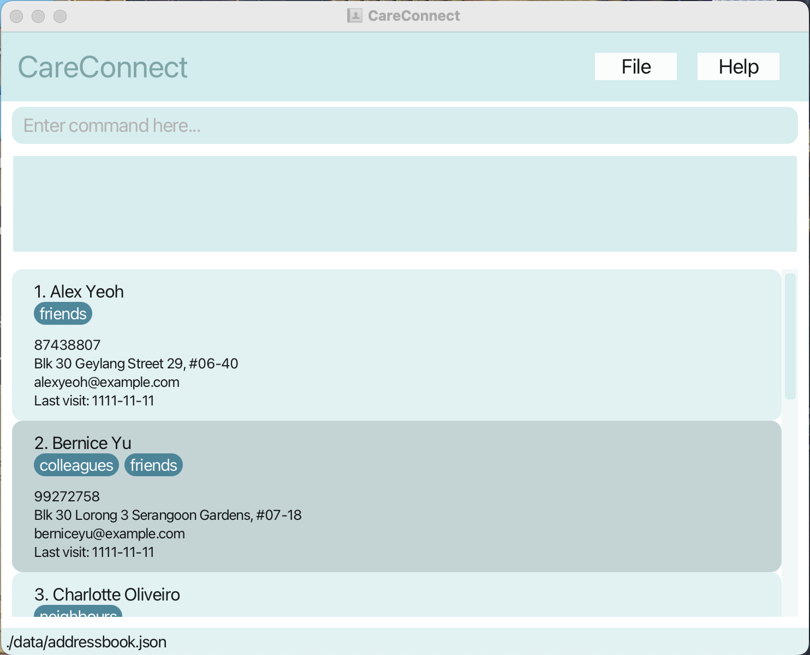
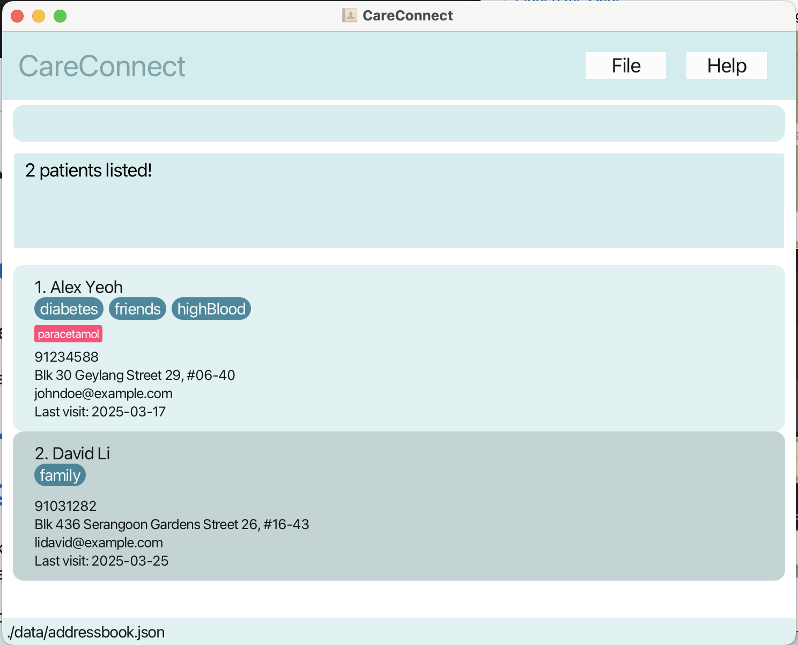

# User Guide

CareConnect is a **desktop app for social workers to manage patient information, optimized for use via a Command Line Interface**.

* Table of Contents
{:toc}

--------------------------------------------------------------------------------------------------------------------

## Quick start

1. Ensure you have Java `17` or above installed in your Computer. 
   **Mac users:** Ensure you have the precise JDK version prescribed [here](https://se-education.org/guides/tutorials/javaInstallationMac.html).

2. Download the latest `.jar` file from [here](https://github.com/se-edu/addressbook-level3/releases).

3. Copy the file to the folder you want to use as the _home folder_ for your AddressBook.

4. Open a command terminal, `cd` into the folder you put the jar file in, and use the `java -jar addressbook.jar` command to run the application. 
   A GUI similar to the below should appear in a few seconds. Note how the app contains some sample data. 
   

5. Type the command in the command box and press Enter to execute it. e.g. typing **`help`** and pressing Enter will open the help window. 
   Some example commands you can try:

   * `list` : Lists all contacts.

   * `add n/John Doe p/98765432 e/johnd@example.com a/John street, block 123, #01-01 v/2025-12-25` : Adds a contact named `John Doe` to the patient contact book.

   * `delete 3` : Deletes the 3rd contact shown in the current list.

   * `clear` : Deletes all contacts.

   * `exit` : Exits the app.

6. Refer to the [Features](#features) and [Command Summary](#command-summary) below for details of each command.

--------------------------------------------------------------------------------------------------------------------

## Command summary

| Action                | Format                                                                 | Example                                                                                                        |
|-----------------------|------------------------------------------------------------------------|----------------------------------------------------------------------------------------------------------------|
| **Add**               | `add n/NAME p/PHONE_NUMBER e/EMAIL a/ADDRESS v/LAST_VISIT [t/TAG]…​`   | `add n/James Ho p/22224444 e/jamesho@example.com a/123, Clementi Rd, 1234665 v/2025_01_25 t/diabetes t/cancer` |
| **Clear**             | `clear`                                                                |                                                                                                                |
| **Delete**            | `delete INDEX`                                                         | `delete 3`                                                                                                     |
| **Edit**              | `edit INDEX [n/NAME] [p/PHONE_NUMBER] [e/EMAIL] [a/ADDRESS] [t/TAG]…​` | `edit 2 n/James Lee e/jameslee@example.com`                                                                    |
| **Tag**               | `tag INDEX t/Tag`                                                      | `tag 2 t/highBloodPressure`                                                                                    |
| **Delete Tag**        | `untag INDEX t/Tag`                                                    | `untag 2 t/highBloodPressure`                                                                                  |
| **Find**              | `find KEYWORD [MORE_KEYWORDS]`                                         | `find James Jake`                                                                                              |
| **List**              | `list`                                                                 |
| **Help**              | `help`                                                                 |
| **Prescribe**         | `prescribe INDEX m/MEDICINE_NAME`                                      | `prescribe 1 m/paracetamol`                                                                                    |
| **Unprescribe**       | `unprescribe INDEX m/MEDICINE_NAME`    `unprescribe INDEX m/all`   | `unprescribe 1 m/anarex`    `unprescribe 1 m/all`                                                          |
| **Last Visit**        | `lastVisit INDEX d/LAST_VISIT_DATE i/LAST_VISIT_INFO`                  | `lastVisit 1 d/2025-03-15 i/Patient has been on track with at-home physiotherapy.`                             |
| **Delete Last Visit** | `delLastVisit INDEX`                                                   | `delLastVisit 21`                                                                                              |

--------------------------------------------------------------------------------------------------------------------

## Features

**:information_source: Notes about the command format:** 

* Words in `UPPER_CASE` are the parameters to be supplied by the user. 
  e.g. in `add n/NAME`, `NAME` is a parameter which can be used as `add n/John Doe`.

* Items in square brackets are optional. 
  e.g. `n/NAME [t/TAG]` can be used as `n/John Doe t/friend` or as `n/John Doe`.

* Items with `…`​ after them can be used multiple times including zero times. 
  e.g. `[t/TAG]…​` can be used as ` ` (i.e. 0 times), `t/friend`, `t/friend t/family` etc.

* Parameters can be in any order. 
  e.g. if the command specifies `n/NAME p/PHONE_NUMBER`, `p/PHONE_NUMBER n/NAME` is also acceptable.

* Extraneous parameters for commands that do not take in parameters (such as `help`, `list`, `exit` and `clear`) will be ignored. 
  e.g. if the command specifies `help 123`, it will be interpreted as `help`.

* If you are using a PDF version of this document, be careful when copying and pasting commands that span multiple lines as space characters surrounding line-breaks may be omitted when copied over to the application.

### Viewing help : `help`

Shows a message explaining how to access the help page.

Format: `help`

### Adding a patient: `add`

Adds a patient to the patient contact book.

Format: `add n/NAME p/PHONE_NUMBER e/EMAIL a/ADDRESS v/LAST_VISIT [t/TAG]…​`

:bulb: **Tip:**
A patient can have any number of tags (including 0)

Examples:
* `add n/John Doe p/98765432 e/johnd@example.com a/John street, block 123, #01-01 v/2025-01-12`
* `add n/Betsy Crowe t/friend e/betsycrowe@example.com a/Newgate Prison p/1234567 v/2024-02-12 t/criminal`

### Listing all patients : `list`

Shows a list of all patients in the patient contact book.

Format: `list`

### Editing a patient : `edit`

Edits an existing patient in the patient contact book.

Format: `edit INDEX [n/NAME] [p/PHONE] [e/EMAIL] [a/ADDRESS] [t/TAG]…​`

* Edits the patient at the specified `INDEX`. The index refers to the index number shown in the displayed patient list. The index **must be a positive integer** 1, 2, 3, …​
* At least one of the optional fields must be provided.
* Existing values will be updated to the input values.
* When editing tags, the existing tags of the patient will be removed i.e. adding of tags is not cumulative.

Examples:
*  `edit 1 p/91234567 e/johndoe@example.com` Edits the phone number and email address of the 1st patient to be `91234567` and `johndoe@example.com` respectively.
*  `edit 2 n/Betsy Crower t/` Edits the name of the 2nd patient to be `Betsy Crower` and clears all existing tags.

### Tag a patient : `Tag`

Tag an existing patient in the patient contact book.

Format: `edit INDEX [t/TAG]…​`

* Tag the patient at the specified `INDEX`. The index refers to the index number shown in the displayed patient list. The index **must be a positive integer** 1, 2, 3, …​
* At least one of the optional fields must be provided.
* Existing values will be updated to the input values.
* When editing tags, the existing tags of the patient will be removed i.e. adding of tags is not cumulative.
* You can remove all the patient’s tags by typing `t/` without
  specifying any tags after it.

Examples:
*  `edit 1 t/diabetes` Add the tag `diabetes` to the 1st patient.
*  `edit 2 n/Betsy Crower t/` Remove all the tag(s) of the 2nd patient.

### Adding medication to a patient : `prescribe`

Adds medication to an existing patient in the patient contact book.

Format: `prescribe INDEX m/MEDICINE_NAME`

* Adds medication to the patient at the specified `INDEX`. The index refers to the index number shown in the displayed patient list. The index **must be a positive integer** 1, 2, 3, …​
* The MEDICINE_NAME field must be provided
* The medication will be added on to existing medications i.e. adding of medications is cumulative.

Examples:
*  `prescribe 1 m/panadol` Adds the panadol medication to the 1st patient.
*  `prescribe 2 m/panadol` Adds the panadol medication to the 2nd patient.

### Removing all medication from a patient : `unprescribe`

Remove all medication from an existing patient in the patient contact book.

Format: `unprescribe INDEX m/MEDICINE_NAME` or `unprescribe INDEX m/all`

* Removes medication from the patient at the specified `INDEX`. The index refers to the index 
  number shown in the displayed patient list. The index **must be a positive integer** 1, 2, 3, …​
* The index refers to the index number shown in the displayed patient list. The index **must be a positive integer** 1, 2, 3, …​
* `unprescribe INDEX m/all` removes all medication from the list 

Examples:
*  `unprescribe 1 m/all` Removes all medication from the 1st patient.
*  `unprescribe 2 m/panadol` Removes the panadol medication from the 2nd patient.

### Adding last visit record to a patient : `lastVisit`

Adds last visit record to an existing patient in the patient contact book.

Format: `lastVisit INDEX v/LAST_VISIT`

* Adds last visit record to the patient at the specified `INDEX`. The index refers to the index number shown in the displayed patient list. The index **must be a positive integer** 1, 2, 3, …​
* The LAST_VISIT field must be provided.

Examples:
*  `lastVisit 1 v/ 5 March 2025 - Patient is more engaged and active this week.` Adds the record '5 March 2025 - Patient is more engaged and active this week.' to the 1st patient.
*  `lastVisit 2 v/ 27 February 2025` Adds the record '27 February 2025' to the 2nd patient.

### Locating patients by name: `find`

Finds patients whose names contain any of the given keywords.

Format: `find KEYWORD [MORE_KEYWORDS]`

* The search is case-insensitive. e.g. `hans` will match `Hans`
* The order of the keywords does not matter. e.g. `Hans Bo` will match `Bo Hans`
* Only the name is searched.
* Only full words will be matched e.g. `Han` will not match `Hans`
* patients matching at least one keyword will be returned (i.e. `OR` search).
  e.g. `Hans Bo` will return `Hans Gruber`, `Bo Yang`

Examples:
* `find John` returns `john` and `John Doe`
* `find alex david` returns `Alex Yeoh`, `David Li` 
  

### Deleting a patient : `delete`

Deletes the specified patient from the patient contact book.

Format: `delete INDEX`

* Deletes the patient at the specified `INDEX`. The index refers to the index number shown in the displayed patient list. The index **must be a positive integer** 1, 2, 3, …​
* The index refers to the index number shown in the displayed patient list.
* The index **must be a positive integer** 1, 2, 3, …​

Examples:
* `list` followed by `delete 2` deletes the 2nd patient in the patient contact book.
* `find Betsy` followed by `delete 1` deletes the 1st patient in the results of the `find` command.

### Clearing all entries : `clear`

Clears all entries from the patient contact book.

Format: `clear`

### Exiting the program : `exit`

Exits the program.

Format: `exit`

### Deleting the last visit information : `delLastVisit`

Deletes the last visit information of a patient

Format: `delLastVisit INDEX`

* The index refers to the index number shown in the displayed patient list. The index **must be a positive integer** 1, 2, 3, …​
* The index **must be a positive integer** 1, 2, 3, …​

### Saving the data

AddressBook data are saved in the hard disk automatically after any command that changes the data. There is no need to save manually.

### Editing the data file

AddressBook data are saved automatically as a JSON file `[JAR file location]/data/addressbook.json`. Advanced users are welcome to update data directly by editing that data file.

:exclamation: **Caution:**
If your changes to the data file makes its format invalid, AddressBook will discard all data and start with an empty data file at the next run. Hence, it is recommended to take a backup of the file before editing it. 
Furthermore, certain edits can cause the AddressBook to behave in unexpected ways (e.g., if a value entered is outside the acceptable range). Therefore, edit the data file only if you are confident that you can update it correctly.

--------------------------------------------------------------------------------------------------------------------

## FAQ

**Q**: How do I transfer my data to another Computer? 
**A**: Install the app in the other computer and overwrite the empty data file it creates with the file that contains the data of your previous AddressBook home folder.

--------------------------------------------------------------------------------------------------------------------

## Known issues

1. **When using multiple screens**, if you move the application to a secondary screen, and later switch to using only the primary screen, the GUI will open off-screen. The remedy is to delete the `preferences.json` file created by the application before running the application again.
2. **If you minimize the Help Window** and then run the `help` command (or use the `Help` menu, or the keyboard shortcut `F1`) again, the original Help Window will remain minimized, and no new Help Window will appear. The remedy is to manually restore the minimized Help Window.
